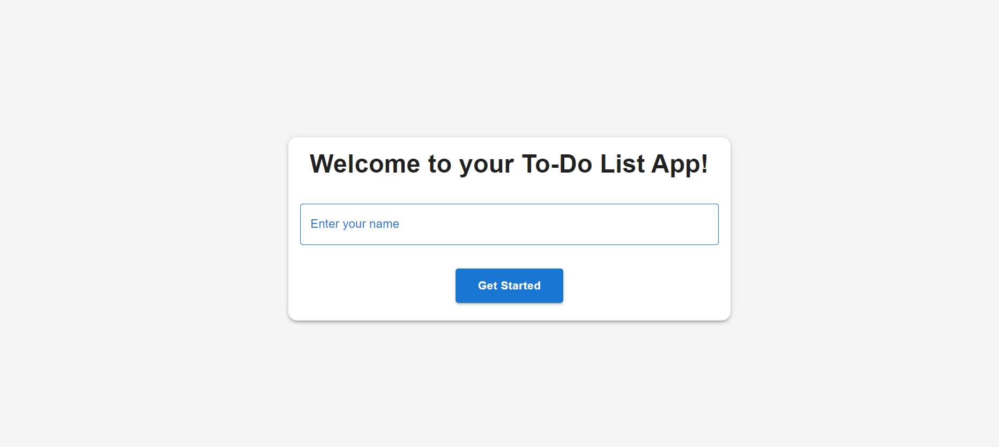
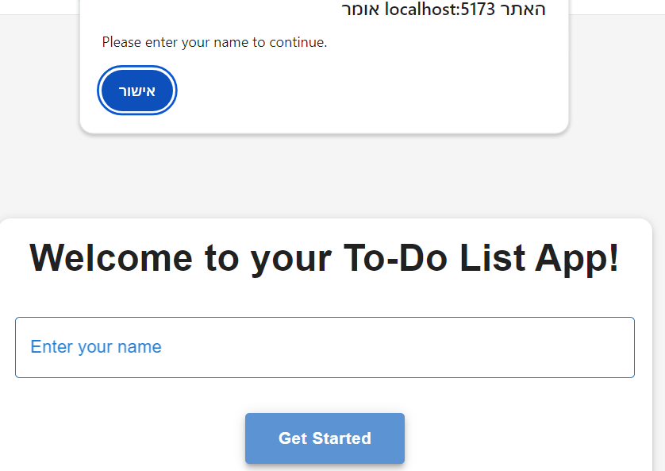
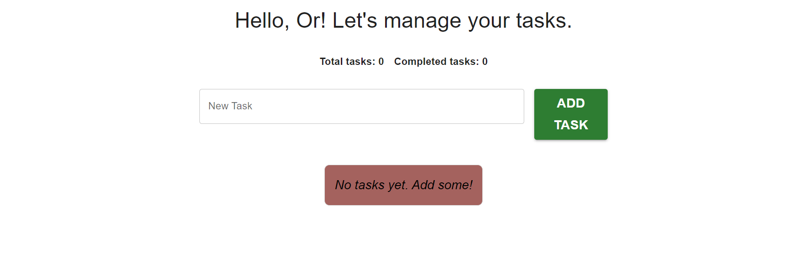
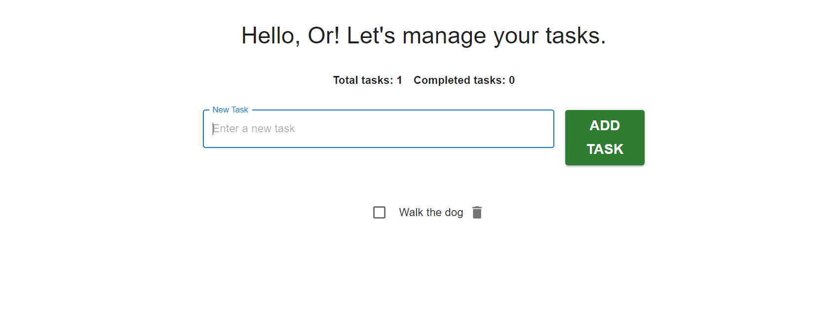
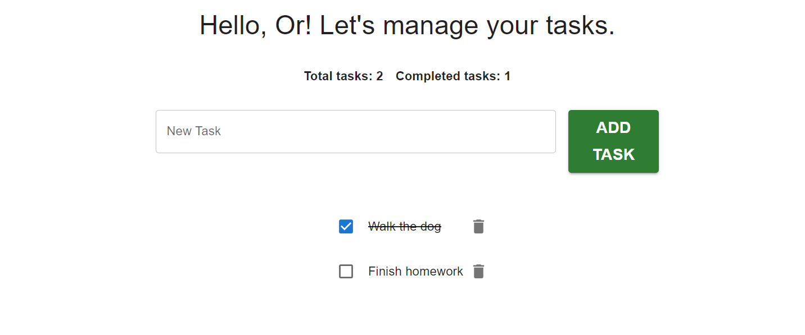

# To-Do-List-App-v2

## Description
To-Do-List-App-v2 is an enhanced task management application built with React and Material-UI (MUI). It offers a sleek, user-friendly interface for managing tasks efficiently, providing users with advanced styling, functionality, and a seamless experience.

## Features
- ** Home Page**: Welcome screen with user name input.
- **Add Tasks**: Add new tasks seamlessly.
- **Mark as Completed**: Toggle tasks as completed or incomplete.
- **Remove Tasks**: Delete tasks with a single click.
- **Task Summary**: View total and completed task counts.
- **Real-Time Updates**: Automatically updates the task list and count.
- **Persistent Storage**: Tasks are saved in local storage and remain after refreshing the page.
- **Material-UI Integration**: A modern and responsive design powered by Material-UI components.
- **Keyboard Accessibility**: Navigate and interact with tasks using keyboard shortcuts.

## Table of Contents
- [Features](#features)
- [Setup and Installation](#setup-and-installation)
- [Usage](#usage)
- [Technologies Used](#technologies-used)
- [Screenshots](#screenshots)
- [Future Improvements](#future-improvements)
- [Contact Information](#contact-information)

## Setup and Installation
Follow these steps to set up the project locally:
1. Clone the repository: 
    git clone https://github.com/OrBenNaim/React-Projects.git

2. Navigate to the Tic-Tac-Toe directory:
    cd React-Projects/To-Do-List-App-v2

3. Install the dependencies:
    npm install

4. Start the development server:
    npm run dev

5. Open http://localhost:5173 in your browser to view the app.

## Usage
1. Start at the Home Page and enter your name to proceed.
2. Click the Add Task button to add it to the list.
3. Mark a task as completed by checking the checkbox next to it.
4. Remove a task by clicking the delete icon.
5. View the total and completed task counts above the task list.

## Technologies Used
- React: Component-based UI library for building interactive interfaces.
- TypeScript: Ensures type safety and better code maintainability.
- Material-UI (MUI): A modern React component library for sleek and accessible
- Vite: Fast development server and build tool.
- Local Storage: Persists task data across sessions.

## Future Improvements
- Advanced Sorting: Allow sorting tasks by name or completion status.
- Search Feature: Add a search bar to filter tasks by keywords.
- Task Due Dates: Include an optional due date field for tasks.
- Dark Mode: Add support for a dark theme.

## Screenshots
### Home Page

### Enter Name First

### Tasks Page

### Add Tasks

### Toggle Task Status

## Contact Information
- GitHub: OrBenNaim
- Email: orbennaim123@gmail.com
- LinkedIn: linkedin.com/in/or-ben-naim-eee